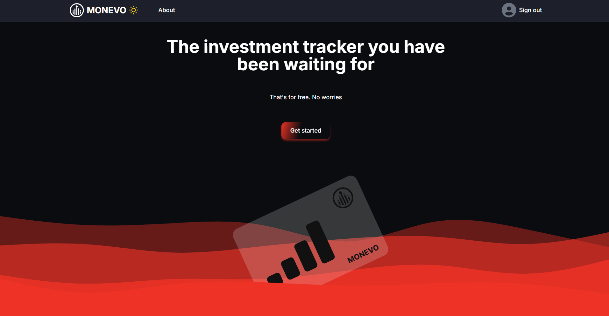
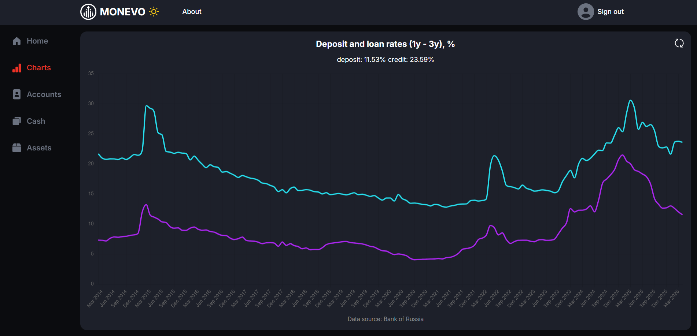

# 🪙 Monevo

Monevo is a modern investment portfolio tracker that helps users store and manage all their assets in one place.  
The application allows investors to monitor their portfolio, track asset performance, and organize investments through a clean and user-friendly interface.

## 📸 Screenshots

### Main Page



### Charts



## 🚀 Live Demo

[https://monevoru.vercel.app/](https://monevoru.vercel.app/)

## 🏗 Features

- User authentication and authorization
- Create, edit and delete assets
- Portfolio overview dashboard
- Asset performance tracking
- Responsive design for desktop and mobile devices

## 🛠 Architecture

- Frontend: Next.js + React + TypeScript
- Backend: Next.js API Routes
- Database: MongoDB + Mongoose
- Authentication: JWT
- Form Handling: React Hook Form

## 🥅 Project Goal

The main idea behind Monevo is to provide a single platform where users can keep track of all their investments and financial assets without switching between multiple services.

The project was created as a pet project for practicing full-stack development using modern React and Next.js technologies.

## 🚩 Installation

Clone the repository:
```bash
git clone https://github.com/VladiWise/monevo.git
```

Navigate to the project folder:
```bash
cd monevo
```

Install dependencies:
```bash
npm install
```

Create a .env.local file and add the required environment variables:
```bash
MONGODB_URL
AUTH_SECRET
YANDEX_CLIENT_ID
YANDEX_CLIENT_SECRET
GOOGLE_CLIENT_ID
GOOGLE_CLIENT_SECRET
```

Run the development server:
```bash
npm run dev
```

Open:
```bash
http://localhost:3000
```
